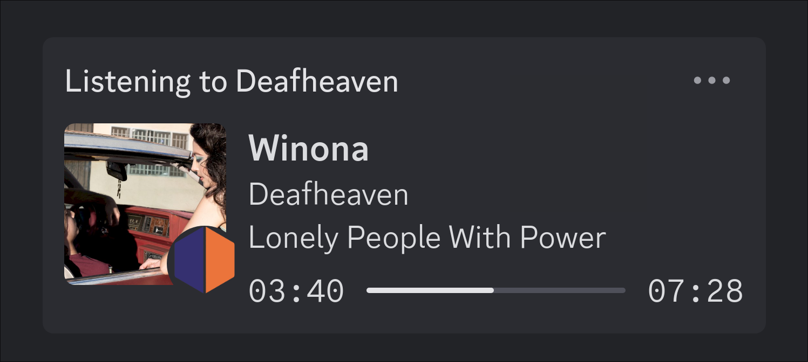
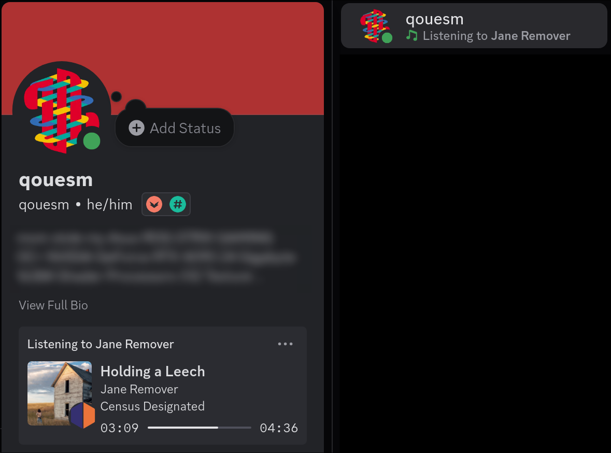

# Vencord ListenBrainz Rich Presence Plugin

This plugin will display a ListenBrainz user's playing now song as a rich presence status.
It is largely based off the work of the [Last.FM plugin](https://github.com/Vendicated/Vencord/blob/main/src/plugins/lastfm/index.tsx) provided officially by [Vencord](https://vencord.dev/).

This plugin must be manually compiled and installed onto a Vencord client.
Details for this can be found in their docs:
- https://docs.vencord.dev/installing/
- https://docs.vencord.dev/installing/custom-plugins/

### See also:
https://github.com/qouesm/listenbrainz-discord-presence
